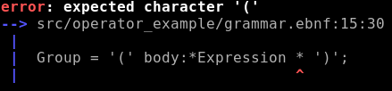
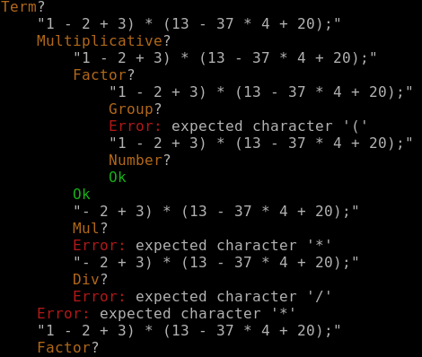

# Peginator

Peginator is a PEG (Parsing Expression Grammar) parser generator written in Rust. It
is specifically made to parse into ASTs (Abstract Syntax Trees), as opposed to most,
streaming-style parsers out there.

It generates both the tree structure and the parsing code that can create that tree from
a `&str`. The generated parsing code is deliberately very simple straightforward Rust
code, which is usually optimized very well by the compiler.

There is an opt-in memoization feature that makes it a proper packrat parser that can
parse any input in linear time and space.

## Documentation

This documentation describes how peginator implements PEGs. A basic understanding of PEGs
are assumed. There are good introductions on
[wikipedia](https://en.wikipedia.org/wiki/Parsing_expression_grammar) or in the
[docs of other parser generators](https://pest.rs/book/grammars/syntax.html).

Peginator is bootstrapped using its own
[syntax and grammar file](https://github.com/badicsalex/peginator/blob/master/grammar.ebnf),
which is somewhat easy-to-read.

Please see [the syntax reference](doc/syntax.md) and
[the API documentation](https://docs.rs/peginator/latest/peginator/)

The [tests](peginator_test/src) can also be used as examples.

## Quick Start

The grammars for peginator are written in a syntax similar to EBNF
(extended Backus-Naur form):

```ebnf
@export
FunctionDef = 'fn' name:Ident '(' param_list:ParamList ')' [ '->' return_value:Type ];

ParamList = self_param:SelfParam {',' params:Param} | params:Param  {',' params:Param} | ;

Param = name:Ident ':' typ: Type;

SelfParam = [ref_type:ReferenceMarker] 'self';

Type = [ref_type:ReferenceMarker] typename:Ident;

ReferenceMarker = @:MutableReference | @:ImmutableReference;

ImmutableReference = '&';
MutableReference = '&' 'mut';

@string
@no_skip_ws
Ident = {'a'..'z' | 'A'..'Z' | '_' | '0'..'9'};
```

Based on the above grammar, peginator will generate the following types:

```ignore
pub struct FunctionDef {
    pub name: Ident,
    pub param_list: ParamList,
    pub return_value: Option<Type>,
}
pub struct ParamList {
    pub self_param: Option<SelfParam>,
    pub params: Vec<Param>,
}
pub struct Param {
    pub name: Ident,
    pub typ: Type,
}
pub struct SelfParam {
    pub ref_type: Option<ReferenceMarker>,
}
pub struct Type {
    pub ref_type: Option<ReferenceMarker>,
    pub typename: Ident,
}
pub enum ReferenceMarker {
    ImmutableReference(ImmutableReference),
    MutableReference(MutableReference),
}
pub struct ImmutableReference;
pub struct MutableReference;
pub type Ident = String;

impl PegParser for FunctionDef { /* omitted */ }
```

Parsing then looks like this:
```ignore
FunctionDef::parse("fn example(&self, input:&str, rectified:&mut Rect) -> ExampleResult;")
```

Which results in the folowing structure:
```ignore
FunctionDef {
    name: "example",
    param_list: ParamList {
        self_param: Some(SelfParam {
            ref_type: Some(ImmutableReference(ImmutableReference)),
        }),
        params: [
            Param {
                name: "input",
                typ: Type {
                    ref_type: Some(ImmutableReference(ImmutableReference)),
                    typename: "str",
                },
            },
            Param {
                name: "rectified",
                typ: Type {
                    ref_type: Some(MutableReference(MutableReference)),
                    typename: "Rect",
                },
            },
        ],
    },
    return_value: Some(Type {
        ref_type: None,
        typename: "ExampleResult",
    }),
}
```

## Debugging

We have pretty errors, based on the first failure of the longest match
(a'la python's parser):



And parse tracing (opt-in, no cost if not used):



## Integration

There are multiple ways to integrate a Peginator grammar to your project:

* You can just use the `peginator-compile` binary
* You can use the `peginate!` macro from the peginator_macro package
* Or you can use the [buildscript helper](https://docs.rs/peginator/latest/peginator/buildscript/struct.Compile.html)

## Contribution

At this point, I'd be happy if someone other than me used this code. Please reach out if you need any help.

## See also

The project is meant to be an almost drop-in replacement for [Tatsu](https://github.com/neogeny/TatSu),
and its fantastic Model Builder. This is why the grammar looks like the way it does.

There are a ton of other PEG parser implementations in Rust, please check them out. Non-exhaustive list in
no particular order:

* [pest](https://github.com/pest-parser/pest)
* [rust-peg](https://github.com/kevinmehall/rust-peg)
* [lrpeg](https://github.com/seanyoung/lrpeg) (left recursive!)

Special mention: [lalrpop](https://github.com/lalrpop/lalrpop)

## License

Licensed under the MIT license
