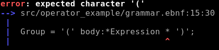
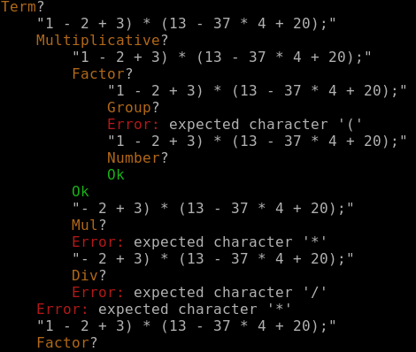

# Peginator

Peginator is a PEG (Parsing Expression Grammar) parser generator written in Rust. It 
is specifically made to parse into ASTs (Abstract Syntax Trees), as opposed to most,
streaming-style parsers out there.

It generates both the tree structure and the parsing code that can create that tree from
a `&str`.

There is an opt-in memoization feature that makes it a proper packrat parser that can
parse any input in linear time and space.

## Example

Let's see the classic calculator as an example, and how it looks in Peginator:

```ebnf
@export
Assignment = lvalue:Identifier '=' expr:Expression ';'$;

Expression = @:Additive | @:Term;
Additive = parts:Term {(parts:Plus | parts:Minus) parts:Term}+;
Plus = '+';
Minus = '-';

Term = @:Multiplicative | @:Factor;
Multiplicative = parts:Factor {(parts:Mul | parts:Div) parts:Factor}+;
Mul = '*';
Div = '/';

Factor = @:Group | @:Number;
Group = '(' body:*Expression ')';

@string
@no_skip_ws
Number = {'0'..'9'}+;

@string
@no_skip_ws
Identifier = {'a'..'z' | '0'..'9' | '_'}+;
```

This will be converted to the following types:

```rust
pub struct OneExpression {
    pub expr: Expression,
}
pub enum Expression {
    Additive(Additive),
    Term(Term),
}

pub struct Additive {
    pub parts: Vec<Additive_parts>,
}
pub enum Additive_parts {
    Minus(Minus),
    Plus(Plus),
    Term(Term),
}
pub struct Plus;
pub struct Minus;

pub enum Term {
    Factor(Factor),
    Multiplicative(Multiplicative),
}
pub struct Multiplicative {
    pub parts: Vec<Multiplicative_parts>,
}

pub enum Multiplicative_parts {
    Div(Div),
    Factor(Factor),
    Mul(Mul),
}
pub struct Mul;
pub struct Div;
pub enum Factor {
    Group(Group),
    Number(Number),
}

pub struct Group {
    pub body: Box<Expression>,
}
pub type Number = String;

impl peginator::PegParser for OneExpression {...}
```

And the expression:

```
result = (1 - 2 + 3) * (13 - 37 * 4 + 20);
```

Turns into the following tree (less the enum variants):


```rust
Assignment {
    lvalue: "result",
    expr: Multiplicative {
        parts: [
            Group {
                body: Additive {
                    parts: ["1", Minus, "2", Plus, "3"],
                },
            },
            Mul,
            Group {
                body: Additive {
                    parts: [
                        "13",
                        Minus,
                        Multiplicative {
                            parts: ["37", Mul, "4"],
                        },
                        Plus,
                        "20",
                    ],
                },
            },
        ],
    }
}
```

## Debugging

We have pretty errors, based on the first failure of the longest match
(a'la python's parser):



And parse tracing (opt-in, no cost if not used):



## Integration

There are multiple ways to integrate a Peginator grammar to your project:

* You can just use the `peginator-compile` binary
* You can use the `peginate!` macro
* Or you can use the buildscript helper

## Documentation

Documentation is left as an exercise to the reader.

I'm just kidding, I'm on it right now. Meanwhile, you can look at the
[grammar used by the compiler itself](peginator/grammar.ebnf), or the various mini
[examples in the test crate](peginator_test/src).

## Contribution

At this point, I'd be happy if someone other than me used this code. Please reach out if you need any help.

## See also

The project is meant to be an almost drop-in replacement for [Tatsu](https://github.com/neogeny/TatSu),
and its fantastic Model Builder. This is why the grammar looks like the way it does.

There are a ton of other PEG parser implementations in Rust, please check them out. Non-exhaustive list in 
no particular order:

* [pest](https://github.com/pest-parser/pest)
* [rust-peg](https://github.com/kevinmehall/rust-peg)
* [lrpeg](https://github.com/seanyoung/lrpeg) (left recursive!)

Special mention: [lalrpop](https://github.com/lalrpop/lalrpop)

## License

Licensed under the MIT license
